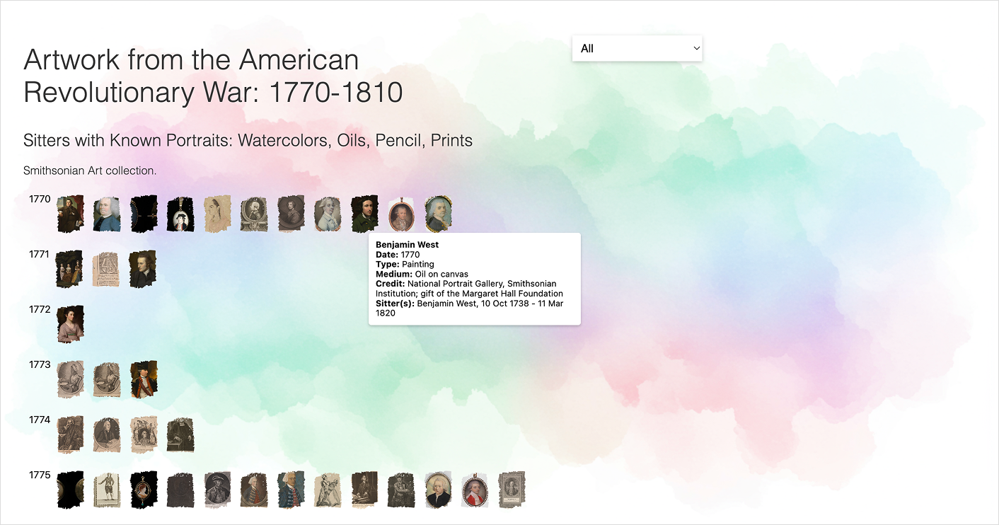
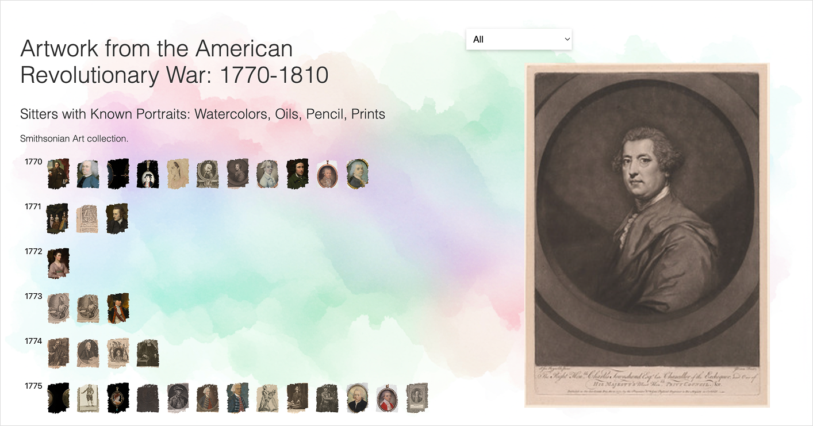

# major-studio-1

## Artwork from the Amercian Revolutionary War: 1770-1810

## Sitters with Known Portraits by Year: Watercolors to Oils

Description: This visualization presents a vertical timeline from 1770 to 1810, showing when artworks were created in four mediums: watercolor, oil, pencil, and prints. Viewers can filter by medium to see how each type of painting appears across the decades, offering a clear view of artistic practices during the Revolutionary era and its aftermath.

## Created by Neven Armanios for Major Studio 1, Fall 2025

## Images used in this project are from the collections of the Metropolitan Museum of Art, New York, and the Smithsonian American Art Museum, Washington, D.C.

<!--  -->

