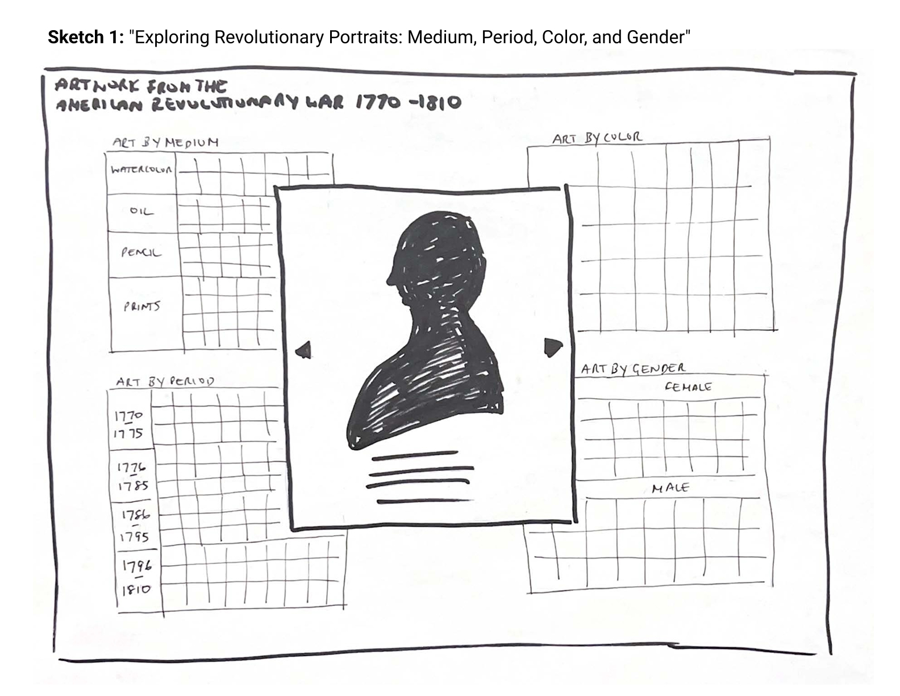
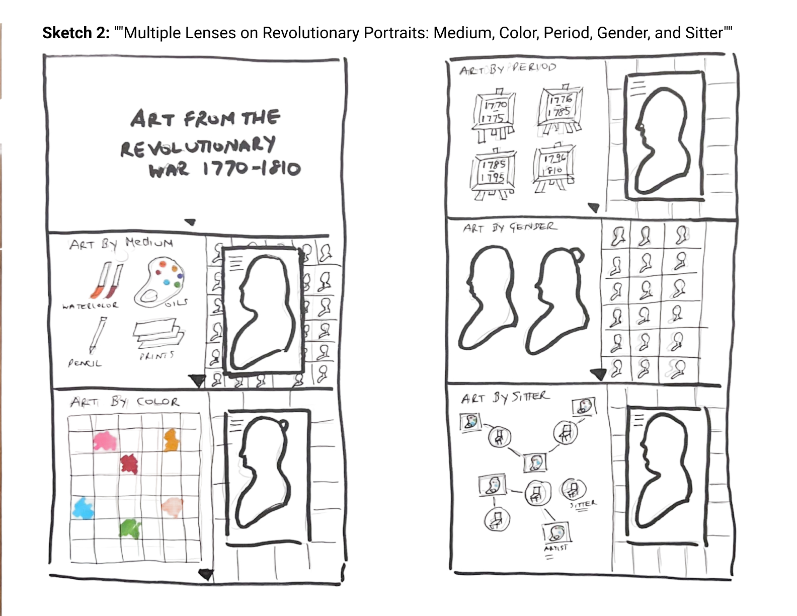
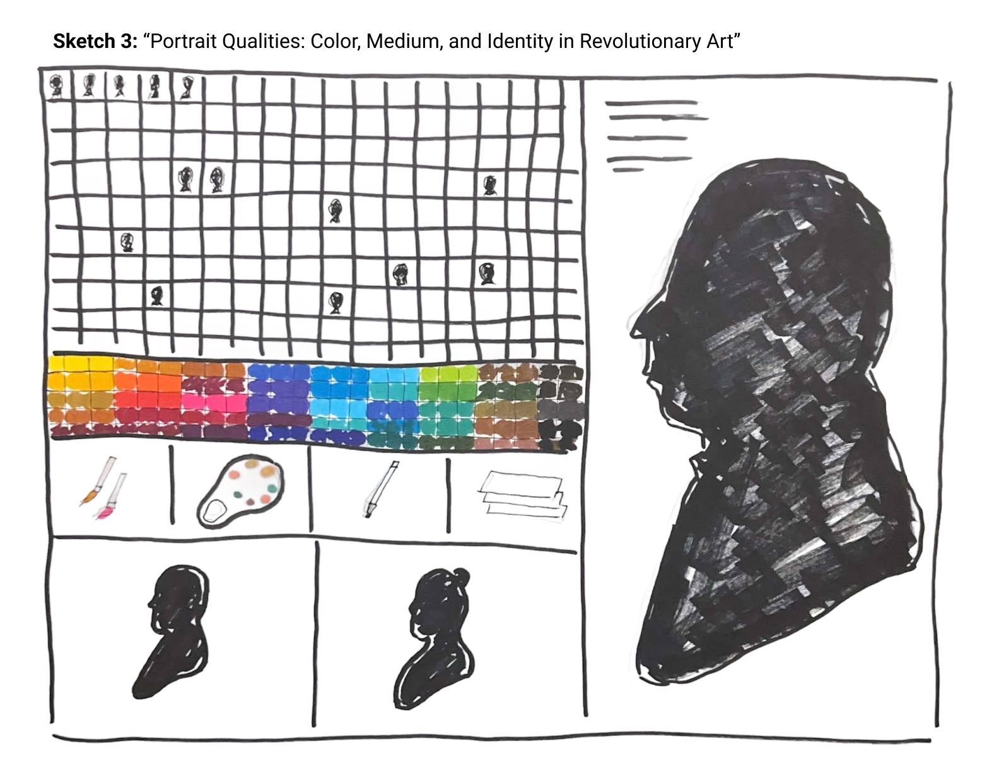

# major-studio-1

## Quantitative Visualization

## Artwork from the American Revolutionary War: 1770-1810

### Sitters with Known Portraits: Watercolors, Oils, Pencil, Prints

Description: This visualization presents a vertical timeline from 1770 to 1810, showing when artworks were created in four mediums: watercolor, oil, pencil, and prints. Viewers can filter by medium to see how each type of painting appears across the decades, offering a clear view of artistic practices during the Revolutionary era and its aftermath.

 

---

#### Created by Neven Armanios for Major Studio 1, Fall 2025

##### Images used in this project are from the collections of the Metropolitan Museum of Art, New York, and the Smithsonian American Art Museum, Washington, D.C.

## Qualitative Visualization

## Sketch 1: "Exploring Revolutionary Portraits: Medium, Period, Color, and Gender"

Description: This captures that the visualization is about artworks from 1770–1810, broken down by different qualitative categories (medium, time period, color, gender), with an individual artwork spotlighted in the center.

 

## Sketch 2: ”Multiple Lenses on Revolutionary Portraits: Medium, Color, Period, Gender, and Sitter”

Description: This sketch shows Revolutionary War portraits (1770–1810) organized through five qualitative lenses: medium, color, period, gender, and sitter–artist relationships. Each category highlights different qualities of the artworks, with a central portrait silhouette acting as a focal point. The aim is to reveal stylistic, emotional, and social dimensions beyond simple counts or dates.

 

## Sketch 3: “Portrait Qualities: Color, Medium, and Identity in Revolutionary Art”

Description: This sketch organizes Revolutionary War portraits by a grid of sitters, a spectrum of dominant colors, artistic mediums (watercolor, oil, pencil, prints), and gender. A large silhouette on the right highlights individual works, balancing collective qualities with focused detail.

 
