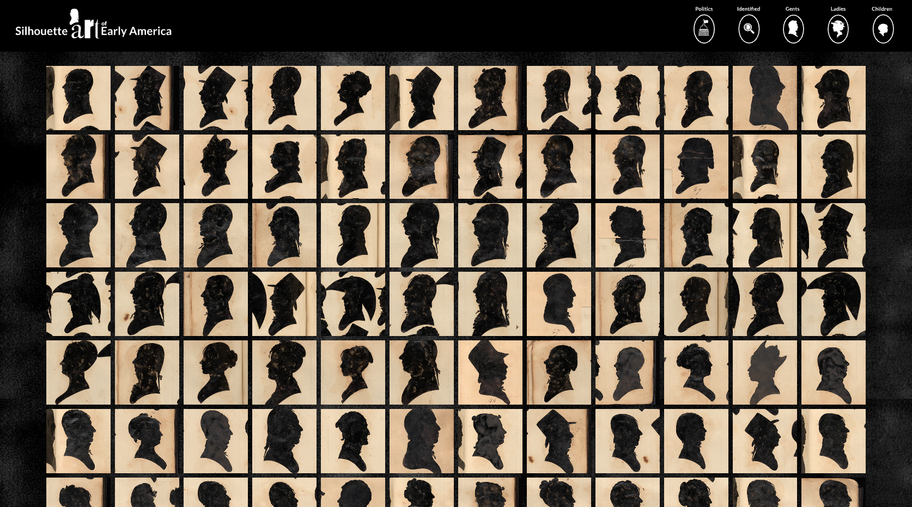

## Silhouette Art of Early America

### Traced in Shadow: The Silhouette Sitters & Diverse Faces of Early America

##### Link

https://narmanios.github.io/major-studio-1/SilhouetteArt/index.html

Silhouette Art of Early America is a data visualization project inspired by the work of William Bache, an early 19th century artist who used a device called a physiognotrace to create nearly 2,000 silhouette portraits.

This project transforms those silhouettes into interactive data. A selection of any number of silhouettes can be made, viewed as a collection and explored through the tracing of their outlines. The outlines of the silhouettes highlight the outlines that William Bache made as he created these art pieces of his sitters. Viewers can also filter the collection by gender. This project invites one to explore these portraits not just as silhouettes but as a window into the image of early America and its past.

 

---

#### Created by Neven Armanios for Major Studio 1, Fall 2025

## Data

#### Images used in this project are from the collections of the Smithsonian American Art Museum, Washington, D.C.

https://huggingface.co/datasets/RevolutionCrossroads/si_us_revolutionary_era_collections/sql-console/_jKV43s

#### Thanks to Thiago Herson, The News School: Parsons School of Design, for assistance with data collection and silhouette outline creation.

https://huggingface.co/datasets/visualizedata/revolutionary_silhouettes/tree/main/json
