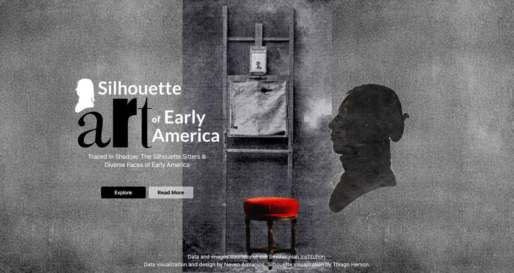
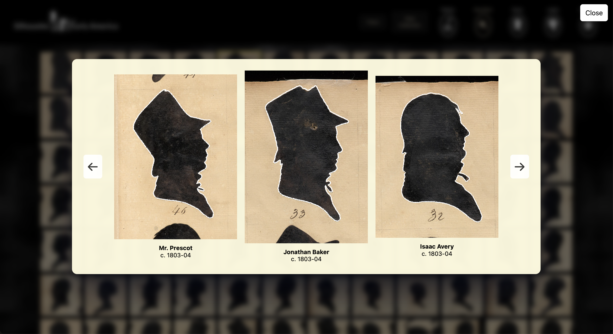
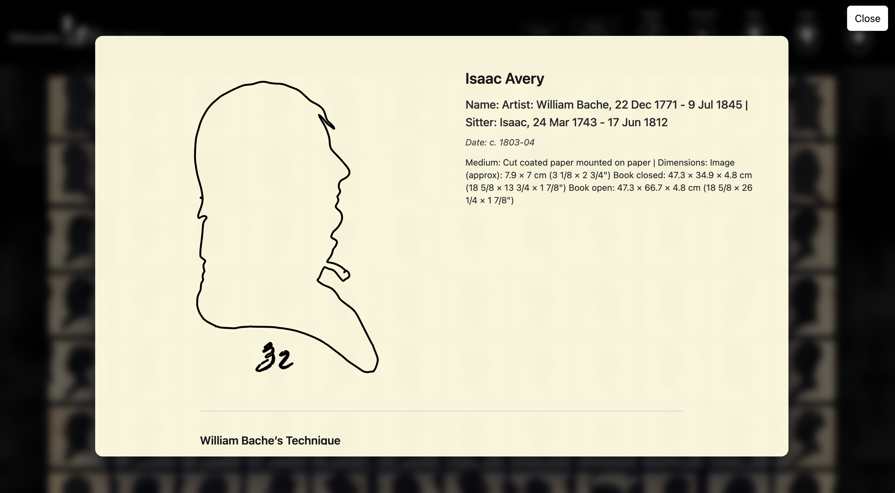

## Silhouette Art of Early America

### Traced in Shadow: The Silhouette Sitters & Diverse Faces of Early America

##### Link

https://narmanios.github.io/major-studio-1/SilhouetteArt/index.html

'Silhouette Art of Early America' is a data visualization inspired by the work of William Bache. It explores almost 2,000 of his silhouettes. Inexpensive to create his sitters could keep them as mementos, share with family or place inside a locket. The sitters include unidentified as well as named men, women and children. Like many similar silhouette artisans', one of the techniques involved carefully tracing a person's profile using a device called a physiognotrace. The outlines and ‘tracing’ of these profiles is visualized in this project. Any combination of silhouettes can be selected and explored.

 

---

#### Created by Neven Armanios for Major Studio 1, Fall 2025

## Data

#### Images used in this project are from the collections of the Smithsonian American Art Museum, Washington, D.C.

https://huggingface.co/datasets/RevolutionCrossroads/si_us_revolutionary_era_collections/sql-console/_jKV43s

#### Thanks to Thiago Herson, The New School: Parsons School of Design, for assistance with data collection and silhouette outline creation.

https://huggingface.co/datasets/visualizedata/revolutionary_silhouettes/tree/main/json
