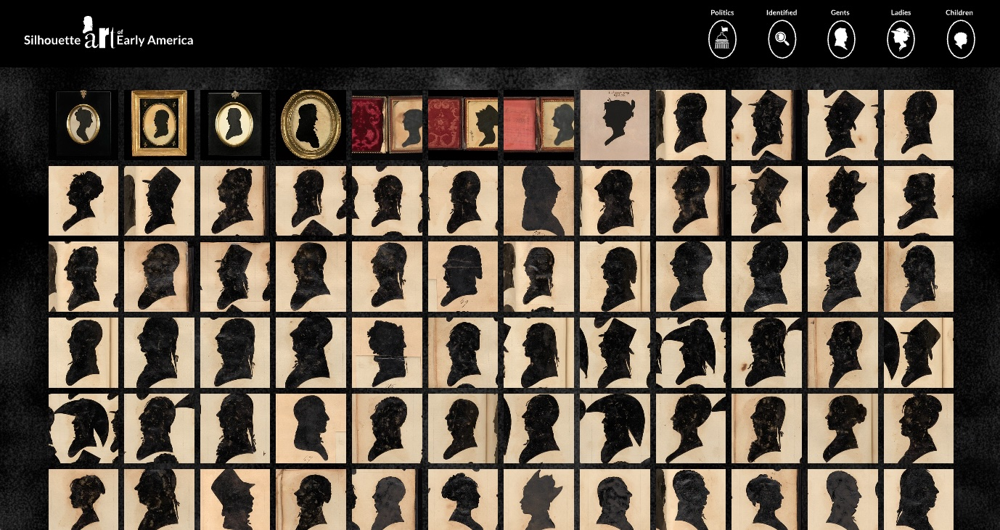

# major-studio-1

## Silhouette Art of Early America

### Traced in Shadow: The Silhouette Sitters & Diverse Faces of Early America

##### Link

https://narmanios.github.io/major-studio-1/SilhouetteArt/index.html

Silhouette Art of Early America is a data visualization project inspired by the work of William Bache, an early 19th century artist who used a device called a physiognotrace to create nearly 2,000 silhouette portraits.

This project transforms those silhouettes into interactive data. Who sat for him, both identified and unidentified, including some of the founding fathers' of the United States can be explored and examined. Viewers can filter the collection by gender and identification status, inviting viewers to explore these portraits not just as images, but as entries into a larger narrative about the past.

 

---

#### Created by Neven Armanios for Major Studio 1, Fall 2025

## Data

#### Images used in this project are from the collections of the the Smithsonian American Art Museum, Washington, D.C.

https://huggingface.co/datasets/RevolutionCrossroads/si_us_revolutionary_era_collections/sql-console/_jKV43s

#### Thanks to by Thiago Herson, The News School: Parsons School of Design, for assistance with data collection and silhouette outline creation.

https://huggingface.co/datasets/visualizedata/revolutionary_silhouettes/tree/main/json
